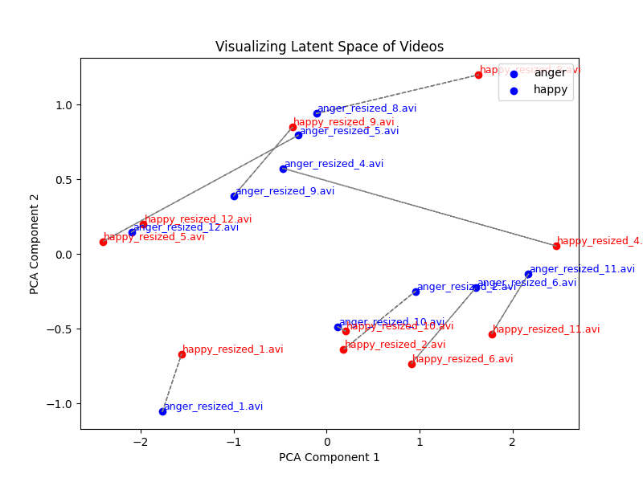

Unsupervised learning of an emotional latent representation in the domain of Food Science

This master's internship is part of the AiMotions project (2024-2028), funded by the French National Research Agency (ANR). AiMotions is an unprecedented joint contribution of Artificial Intelligence, Computer Vision, and Affective Computing to Food Science. 

AiMotions aims to contribute to a better understanding of eating behaviors through the analysis of emotions while eating. Emotional states influence eating behaviors, including motivation to eat, food choice, and amount of food intake. 

However, understanding why and how emotions have a positive or negative impact on eating behaviors remains a vast topic of debate. One of the main reasons is that most studies in Food Science collect emotional feedback using only self-reported questionnaires. Having unbiased implicit data (physiological measures, brain activity, facial expressions), acquired in an ecological context, should improve the quality of the analysis and provide new insights for both fundamental and applied research.
